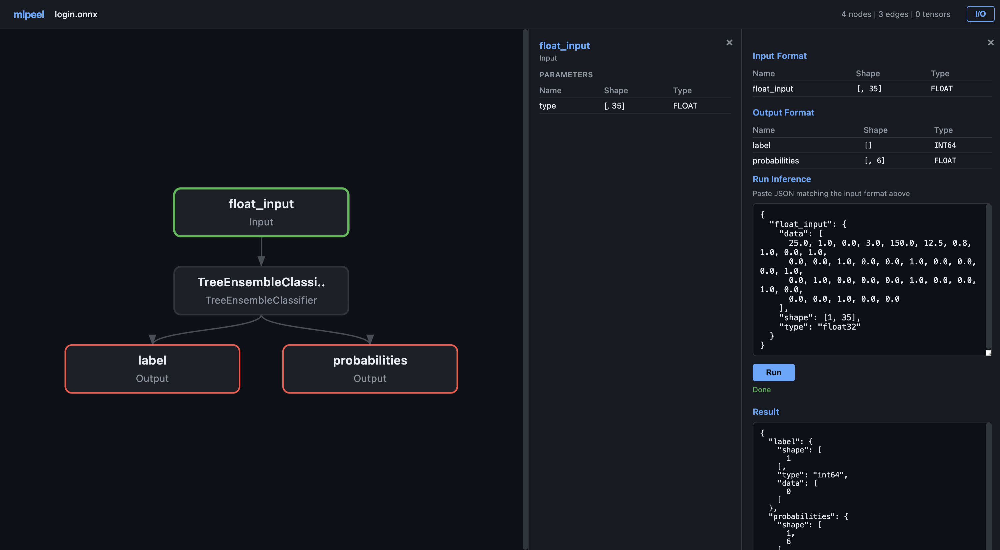

# mlpeel

Minimal-dependency neural network model viewer. Open any supported model file and instantly visualize its architecture as an interactive graph.

```
npx mlpeel model.onnx
```



## Features

- **Minimal dependencies** — core viewer uses only Node.js 22+ built-ins; inference requires `onnxruntime-node`
- **Interactive graph** — pan, zoom, click nodes to inspect shapes, types, and parameters
- **Four formats** — ONNX, Safetensors, GGUF, TFLite
- **Auto-detection** — format recognized from extension or magic bytes
- **JSON mode** — dump model structure as JSON for scripting

## Supported Formats

| Format | Extension | Use case |
|--------|-----------|----------|
| ONNX | `.onnx` | Universal interchange format |
| Safetensors | `.safetensors` | HuggingFace model weights |
| GGUF | `.gguf` | llama.cpp / local LLM inference |
| TFLite | `.tflite` | TensorFlow Lite / mobile / edge |

## Install

```bash
# run directly
npx mlpeel model.onnx

# or install globally
npm install -g mlpeel
```

## Usage

```bash
# open model in browser
mlpeel model.onnx

# custom port
mlpeel model.safetensors --port 3000

# don't open browser
mlpeel model.gguf --no-open

# output as JSON (no server)
mlpeel model.onnx --json
```

## Options

```
mlpeel <model-file> [options]

  --port <n>       Server port (default: 8800)
  --no-open        Don't open browser automatically
  --json           Output model info as JSON (no server)
  -h, --help       Show help
  -v, --version    Show version
```

## How It Works

1. Reads the model file and auto-detects the format
2. Parses the binary structure using a custom built-in parser
3. Builds a graph representation of the model architecture
4. Starts a local HTTP server and opens the viewer in your browser
5. The viewer renders the graph as interactive SVG with pan/zoom

### ONNX

Custom protobuf wire-format decoder that extracts the computation graph — nodes, edges, tensor shapes, and operator attributes — without any `.proto` schema files.

### Safetensors

Reads the JSON header to extract tensor names, shapes, and dtypes. Groups tensors by layer prefix to reconstruct the architecture.

### GGUF

Binary format parser that reads the GGUF v2/v3 header, metadata key-value pairs, and tensor descriptors including quantization types.

### TFLite

FlatBuffers decoder that reads the TFLite schema — operator codes, subgraphs, tensors, and operators — to reconstruct the inference graph.

## Comparison

| Tool | Deps | Formats | Graph | CLI |
|------|------|---------|-------|-----|
| **mlpeel** | 1 optional | 4 | Yes | Yes |
| Netron | Electron | 60+ | Yes | No |
| onnx-tool | pip | 1 | Partial | Yes |

## License

MIT
